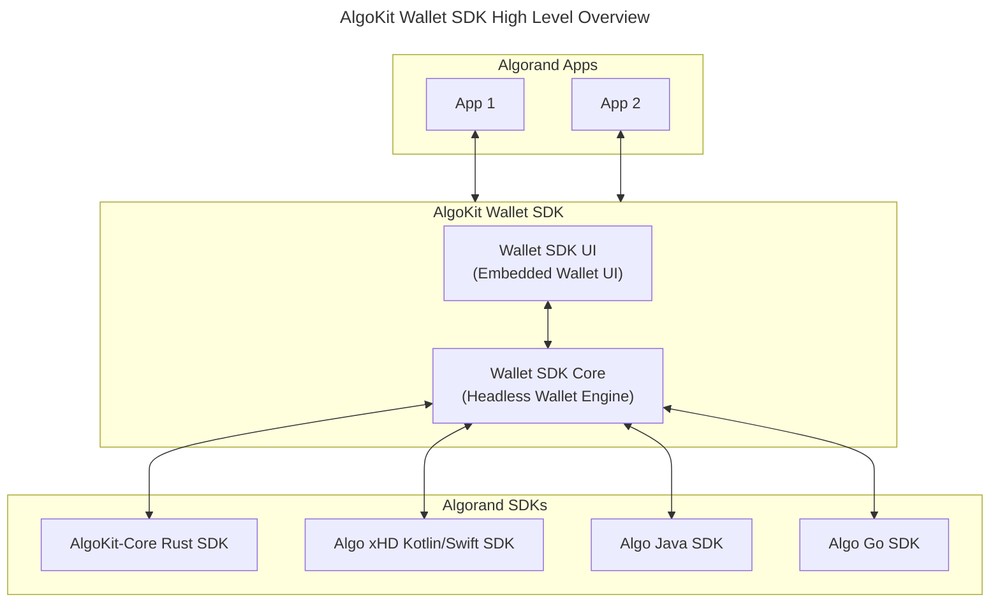
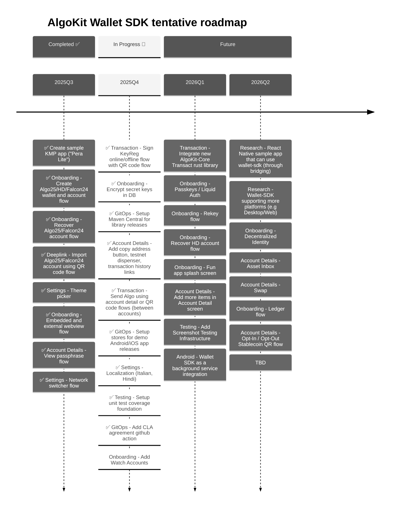
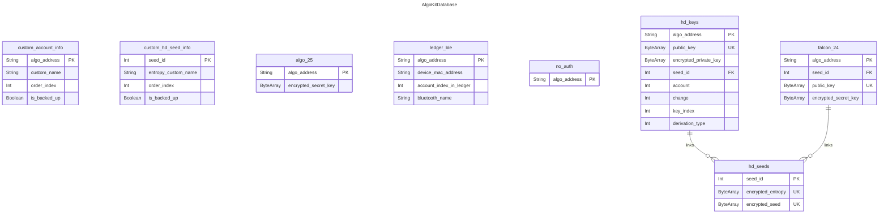

# AlgoKit Wallet SDK

[](https://central.sonatype.com/artifact/com.michaeltchuang.algokit.walletsdk/wallet-sdk-ui)
[](https://central.sonatype.com/artifact/com.michaeltchuang.algokit.walletsdk/wallet-sdk-core)

This mobile utils library project provides common wallet UI components and screens out of the box, allowing native developers to skip building standard wallet functionality and focus more on unique, value-added features for their mobile applications.

## How to Use

Add the following to your `build.gradle.kts`:
```kotlin
dependencies {
    implementation("com.michaeltchuang.algokit.walletsdk:wallet-sdk-ui:3.202504.0")
    implementation("com.michaeltchuang.algokit.walletsdk:wallet-sdk-core:3.202504.0")
}
```

> **Note:** Check Maven Central for the latest
> versions: [wallet-sdk-ui](https://central.sonatype.com/artifact/com.michaeltchuang.algokit.walletsdk/wallet-sdk-ui) | [wallet-sdk-core](https://central.sonatype.com/artifact/com.michaeltchuang.algokit.walletsdk/wallet-sdk-core)

## Overview



The demo apps (Android & iOS) in this repo demonstrate `wallet-sdk` library usage through a simplified "Pera-lite" sample wallet application. Current and planned features include:

- Create and recover accounts (Algo25, Universal HD, Falcon24)
- Theme customization
- Network switching between mainnet/testnet (code hasn't been audited, so use mainnet at your own risk)
- QR code scanning for account imports and keyreg transactions
- Algo-only experience for now (to swap memecoins...please use Pera app, Haystack app, etc)
- Account detail screen
- Passphrase management
- Localization

AlgoKit Wallet SDK currently uses UI theming inspired by [Pera Android](https://github.com/perawallet/pera-android) as a placeholder until official Algorand Foundation branding guidelines are available.



## Project structure

This repo has the following modules:

- **composeDemoApp**: A [Compose Multiplatform](https://github.com/JetBrains/compose-multiplatform) sample wallet app that demonstrates `wallet-sdk` usage.
- **iosDemoApp**: The iOS app for `composeSampleApp`. Open this module in Xcode if needed.
- **wallet-sdk-core**: The AlgoKit Wallet SDK core module - a headless wallet utils library built with [Kotlin Multiplatform](https://developer.android.com/kotlin/multiplatform). It provides foundational wallet functionality and is built on top of [AlgoKit-Core SDK](https://github.com/algorandfoundation/algokit-core), [Algo xHD Swift SDK](https://github.com/algorandfoundation/xHD-Wallet-API-swift), [Algo xHD Kotlin SDK](https://github.com/algorandfoundation/xHD-Wallet-API-kt), [Algo Java SDK](https://github.com/algorand/java-algorand-sdk), and [Algo Go SDK](https://github.com/perawallet/algorand-go-mobile-sdk).
- **wallet-sdk-ui**: The AlgoKit Wallet SDK UI module - an embedded wallet utils library built with [Compose Multiplatform](https://github.com/JetBrains/compose-multiplatform). This module extends wallet-sdk-core and provides ready-to-use UI components for developers who want an integrated wallet interface in their applications.

This project is developed using [Android Studio](https://developer.android.com/studio) (stable version) and the [Kotlin Multiplatform Plugin](https://plugins.jetbrains.com/plugin/14936-kotlin-multiplatform). As a mobile development project, it is primarily developed on macOS, support for Windows and Linux is quite limited.  We also follow the [KMP compatibility guide](https://www.jetbrains.com/help/kotlin-multiplatform-dev/multiplatform-compatibility-guide.html).

## Screenshots

### Sample App - Accounts List

#### Fetching All Accounts Flow


### Wallet-SDK Screens - Onboarding

#### No Accounts Onboarding Flow

 


#### Create Falcon24 Wallet Flow

 


#### Add Falcon24 Account To Existing Wallet Flow


#### Recover Falcon24/Algo25 Account Flow

 
 
 


#### Recover Falcon24/Algo25 Account with QR Code Flow

 
 


### Wallet-SDK Screens - Account Details

#### View Passphrase Flow

 
 
 


### Wallet-SDK Screens - Settings

#### Theme Picker Flow

 

#### Network Switcher Flow

   

#### Create Legacy Algo25 Account Flow

 
 


#### Create Legacy Universal HD Account Flow

 

 


### Wallet-SDK Screens - Signing

#### KeyReg Flow

 
 
 


#### Asset Transfer Flow using QR Code

   
 
 


#### Asset Transfer Flow

 
 
 


## Architecture

# Database Schema



## Contributing
Development happens in this open source repo for the AlgoKit Wallet SDK. Algorand community is always welcome to contribute by reviewing or opening new pull requests.

## Testing

This project is tested with BrowserStack (open source license).

For QR code importing, you can use a tool like [Cyber Chef](https://gchq.github.io/CyberChef/#recipe=Generate_QR_Code('PNG',5,4,'Medium')) to get QR codes online

### 24 word account

```json
{
  "mnemonic": "define claw hungry wave umbrella boost blind never muscle also grab gaze fluid echo predict describe turkey unaware dash phone urge crunch eyebrow abstract team"
}
```

### KeyReg offline (account address should exist on device)
```
algorand://ANUR5SYMURBFD3ELITINYNTHVAKKBCWJ7LGHJRPMQM3KQG25ENMIHYEBNY?type=keyreg
```

### Asset Transfer (receiver address & amount in microAlgos)
```
algorand://7N54HZSGBRQF7FW6YNC6F5H42AT5OXN3F5OQDAXF6H6PDFHNXIEBCJFHOY?amount=1000000&note=1_ALGO_Transfer
```
