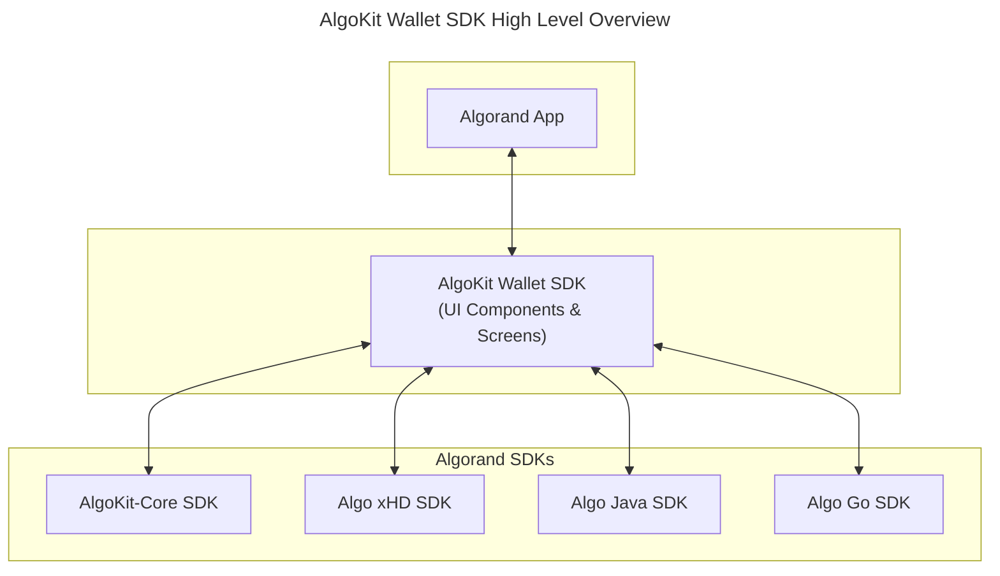
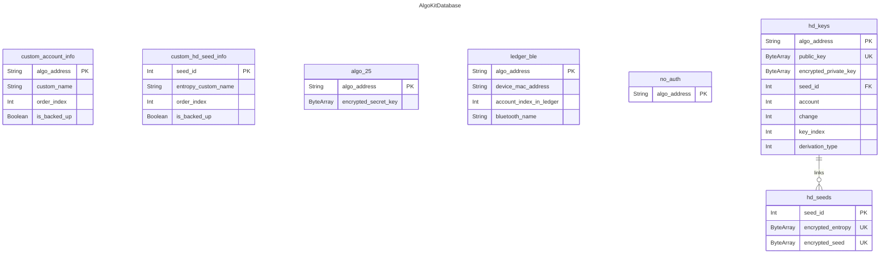

# AlgoKit Wallet SDK

This mobile utils library project provides common wallet UI components and screens out of the box, allowing native developers to skip building standard wallet functionality and focus more on unique, value-added features for their mobile applications.

AlgoKit Wallet SDK currently uses UI theming inspired by [Pera Android](https://github.com/perawallet/pera-android) as a placeholder until official Algorand Foundation branding guidelines are available.

The sample apps (Android/iOS) demonstrate `wallet-sdk` usage through a simplified "Pera-lite" wallet application. Current and planned features include:

- Create and recover accounts (Algo25, HD)
- Theme customization
- Network switching (Mainnet/Testnet)
- QR code scanning for account imports and keyreg transactions
- Algo-native experience
- Account detail screens
- Passphrase management
- Localization

## Project structure

The project has the following modules:

- **composeSampleApp**: A [Compose Multiplatform](https://github.com/JetBrains/compose-multiplatform) sample wallet app that demonstrates `wallet-sdk` usage.
- **iosSampleApp**: The iOS app for `composeSampleApp`. Open this module in Xcode if needed.
- **wallet-sdk**: The AlgoKit Wallet SDK - a UI layer built with [Kotlin Multiplatform](https://developer.android.com/kotlin/multiplatform) on top of [AlgoKit-Core SDK](https://github.com/algorandfoundation/algokit-core), [Algo xHD SDK](https://github.com/algorandfoundation/xHD-Wallet-API-kt), [Algo Java SDK](https://github.com/algorand/java-algorand-sdk), and [Algo Go SDK](https://github.com/perawallet/algorand-go-mobile-sdk) projects. 

This project is developed using [Android Studio](https://developer.android.com/studio) stable version and the [Kotlin Multiplatform Plugin](https://plugins.jetbrains.com/plugin/14936-kotlin-multiplatform).

## Screenshots - Sample App

#### Accounts List Screen

### Wallet-SDK Screens - Onboarding

#### No Accounts Onboarding Flow

 

#### Create HD Wallet Flow

 

#### Add HD Account To Existing Wallet Flow

 
 

#### Recover Algo25 Account Flow

 
 
 

#### Recover Algo25 Account with QR Code Flow

 
 

#### Recover HD Account with QR Code Flow

Coming Soon

### Wallet-SDK Screens - Account Details

#### View Passphrase Flow

 
 
 

### Wallet-SDK Screens - Settings

#### Theme Picker Flow

 

#### Network Switcher Flow

  

#### Create Algo25 Account Flow

  

### Wallet-SDK Screens - Transactions

#### KeyReg

Coming Soon

## Architecture

# Database Schema

## Contributing
Development happens in this open source repo for the AlgoKit Wallet SDK. Algorand community is always welcome to contribute by reviewing or opening new pull requests.
