# AlgoKit Wallet SDK

This mobile utils library project provides common wallet UI components and screens out of the box, allowing native developers to skip building standard wallet functionality and focus more on unique, value-added features for their mobile applications.

AlgoKit Wallet SDK currently uses UI theming inspired by [Pera Android](https://github.com/perawallet/pera-android) as a placeholder until official Algorand Foundation branding guidelines are available.

The sample apps (Android/iOS) demonstrate `wallet-sdk` library usage through a simplified "Pera-lite" demo wallet application. Current and planned features include:

- Create and recover accounts (Algo25, Universal HD, Falcon24)
- Theme customization
- Network switching between Mainnet/Testnet (Code hasn't been audited, so use mainnet at your own risk)
- QR code scanning for account imports and keyreg transactions
- Algo-only experience for now (to swap memecoins...use Pera app, Haystack app, etc)
- Account detail screens
- Passphrase management
- Localization

```mermaid
---
config:
  theme: 'neutral'
---
timeline
    title AlgoKit Wallet SDK tentative roadmap

    section Completed ✅
    2025Q3  : ✅ Create sample KMP app ("Pera Lite")
            : ✅ Onboarding - Create Algo25/HD/Falcon24 wallet and account flow
            : ✅ Onboarding - Recover Algo25/Falcon24 account flow
            : ✅ Deeplink - Import Algo25/Falcon24 account using QR code flow
            : ✅ Settings - Theme picker
            : ✅ Onboarding - Embedded and external webview flow
            : ✅ Account Details - View passphrase flow
            : ✅ Settings - Network switcher flow

    section In Progress 🔄
    2025Q4  : ✅ Transaction - Sign KeyReg online/offline flow with QR code flow
            : ✅ Account Details - Add copy address button
            : ✅ Onboarding - Encrypt secret keys in DB
            : ✅ GitOps - Setup Maven Central for library releases
            : 🔄 Transaction - Send Algo flow (between accounts)
            : 🔄 Account Details - Add testnet dispenser link
            : ✅ Settings - Localization (Italian)
            : Settings - Localization (Hindi)
            : GitOps - Setup App / Play store for demo app releases
            : Testing - Setup unit test coverage foundation

    section Future
    2026Q1  : Transaction - Integrate new AlgoKit-Core Transact rust library
            : Onboarding - Passkeys / Liquid Auth
            : Onboarding - Rekey flow
            : Onboarding - Recover HD account flow
            : Onboarding - Ledger flow
            : Onboarding - Fun app splash screen
            : Account Details - Add more items in Account Detail screen
            : Testing - Add Screenshot Testing Infrastructure
            : Android - Wallet SDK as a background service integration
    2026Q2  : Research - React Native sample app that can use wallet-sdk (through bridging)
            : Research - Wallet-SDK supporting more platforms (e.g Desktop/Web)
            : Onboarding - Decentralized Identity
            : Account Details - Asset Inbox
            : Account Details - Swap
            : TBD
```

## Project structure

The project has the following modules:

- **composeDemoApp**: A [Compose Multiplatform](https://github.com/JetBrains/compose-multiplatform) sample wallet app that demonstrates `wallet-sdk` usage.
- **iosDemoApp**: The iOS app for `composeSampleApp`. Open this module in Xcode if needed.
- **wallet-sdk-core**: The AlgoKit Wallet SDK core module - a headless wallet utils library built with [Kotlin Multiplatform](https://developer.android.com/kotlin/multiplatform). It provides foundational wallet functionality and is built on top of [AlgoKit-Core SDK](https://github.com/algorandfoundation/algokit-core), [Algo xHD Swift SDK](https://github.com/algorandfoundation/xHD-Wallet-API-swift), [Algo xHD Kotlin SDK](https://github.com/algorandfoundation/xHD-Wallet-API-kt), [Algo Java SDK](https://github.com/algorand/java-algorand-sdk), and [Algo Go SDK](https://github.com/perawallet/algorand-go-mobile-sdk).
- **wallet-sdk-ui**: The AlgoKit Wallet SDK UI module - an embedded wallet utils library built with [Compose Multiplatform](https://github.com/JetBrains/compose-multiplatform). This module extends wallet-sdk-core and provides ready-to-use UI components for developers who want an integrated wallet interface in their applications.

This project is developed using [Android Studio](https://developer.android.com/studio) (stable version) and the [Kotlin Multiplatform Plugin](https://plugins.jetbrains.com/plugin/14936-kotlin-multiplatform). As a mobile development project, it is primarily developed on macOS, support for Windows and Linux is quite limited.  We also follow the [KMP compatibility guide](https://www.jetbrains.com/help/kotlin-multiplatform-dev/multiplatform-compatibility-guide.html).

## Screenshots

### Sample App - Accounts List

#### Fetching All Accounts Flow

### Wallet-SDK Screens - Onboarding

#### No Accounts Onboarding Flow

 

#### Create Falcon24 Wallet Flow

 

#### Add Falcon24 Account To Existing Wallet Flow

#### Recover Falcon24/Algo25 Account Flow

 
 
 

#### Recover Falcon24/Algo25 Account with QR Code Flow

 
 

### Wallet-SDK Screens - Account Details

#### View Passphrase Flow

 
 
 

### Wallet-SDK Screens - Settings

#### Theme Picker Flow

 

#### Network Switcher Flow

   

#### Create Legacy Algo25 Account Flow

 
 

#### Create Legacy Universal HD Account Flow

 

 

### Wallet-SDK Screens - Transactions

#### KeyReg Flow

   
 
 

## Architecture

# Database Schema

## Contributing
Development happens in this open source repo for the AlgoKit Wallet SDK. Algorand community is always welcome to contribute by reviewing or opening new pull requests.
